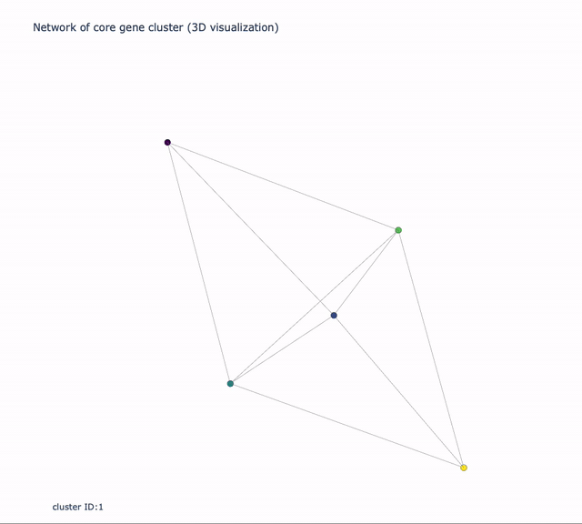

<h1 align="center">Welcome to 3D-network-graph </h1>
<p align="center">
  <a>
    
  </a>
  <a>
    
  </a>
</p>

##  Demo




## Information

The network is generated by [igraph package](https://igraph.org/) and the 3D graph is created based on [Plotly](https://plotly.com/python/).

The table of fungal [JGI](https://genome.jgi.doe.gov/) protein ID within one cluster is in file [example.txt](./example.txt) which V1 and V2 are the paired sequences, and V3 is their Bit-Score that estimated using [MMseqs2](https://github.com/soedinglab/MMseqs2). The species for the sequences is in [group.txt](./group.txt), Plotly can not detect groups by the characters so that it has to be converted to the number like the third coloum.

The following python packages were required:

```python
 pip install igraph 
 pip install chart_studio.plotly 
 pip install plotly.offline 
 pip install plotly.graph_objs 
```


## Author

🥀  **Pei-Yu Lin**
- Github: [@beritlin](https://github.com/beritlin)
- Twitter: [@PeiYuLin11](https://twitter.com/PeiYuLin11) 